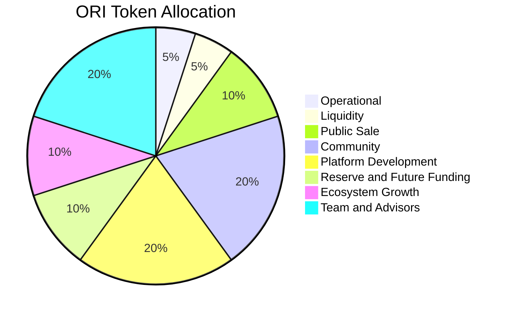
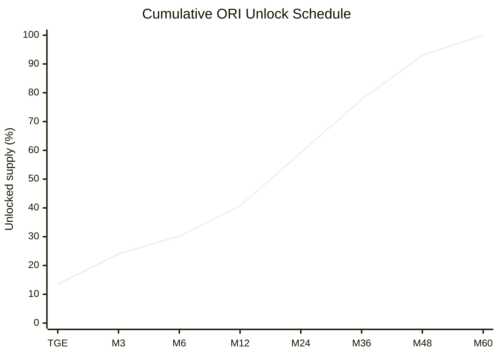

# ORI Tokenomics

---
date: 2026-07-02
status: Public tokenomics reference
---

## Summary

ORI is the native protocol coordination token around the Orina ecosystem. It supports ecosystem access, fee alignment, participation, incentive systems where activated, and future governance functions.

ORI does not define transaction correctness. ATP remains the settlement authority for escrow release, refunds, state transitions, receipt minting, and final transaction state.

## Token Snapshot

| Field | Value |
| --- | --- |
| Token name | ORINA |
| Token symbol | ORI |
| Token type | Utility / protocol coordination token |
| Chain | BNB Smart Chain |
| Standard | BEP-20 |
| Decimals | 18 |
| Total supply | 1,000,000,000 ORI |
| Contract | [`0x093969C2Bb194e7424534918ECa5119FA72a61d6`](https://bscscan.com/token/0x093969c2bb194e7424534918eca5119fa72a61d6) |

## Distribution

| Category | Allocation | Tokens | TGE unlock | Cliff | Vesting |
| --- | ---: | ---: | ---: | --- | --- |
| Operational | 5% | 50,000,000 ORI | 50% | None | 12 months |
| Liquidity | 5% | 50,000,000 ORI | 100% | None | None |
| Public Sale | 10% | 100,000,000 ORI | 25% | None | 3 months |
| Community | 20% | 200,000,000 ORI | 10% | None | 48 months |
| Platform Development | 20% | 200,000,000 ORI | 5% | None | 60 months |
| Reserve and Future Funding | 10% | 100,000,000 ORI | 0% | None | 60 months |
| Ecosystem Growth and Partnerships | 10% | 100,000,000 ORI | 5% | None | 36 months |
| Team and Advisors | 20% | 200,000,000 ORI | 0% | 3 months | 48 months |
| **Total** | **100%** | **1,000,000,000 ORI** |  |  |  |

## Unlock Timeline

The unlock model is derived from the allocation, TGE unlock, cliff, and vesting schedule above.

| Milestone | Approx. unlocked supply | Approx. unlocked tokens |
| --- | ---: | ---: |
| TGE | 13.5% | 135,000,000 ORI |
| Month 3 | 24.0% | 240,000,000 ORI |
| Month 6 | 30.2% | 302,000,000 ORI |
| Month 12 | 40.7% | 407,000,000 ORI |
| Month 24 | 59.2% | 592,000,000 ORI |
| Month 36 | 77.7% | 777,000,000 ORI |
| Month 48 | 93.0% | 930,000,000 ORI |
| Month 60 | 100.0% | 1,000,000,000 ORI |

## Allocation Purpose

### Operational

50% unlocks at TGE, followed by linear vesting over 12 months. This allocation supports operational execution, maintenance, and administrative continuity during early ecosystem growth.

### Liquidity

The liquidity allocation is fully available at TGE with no cliff or vesting. It is reserved for launch liquidity and orderly market access conditions for ORI.

### Public Sale

25% unlocks at TGE, followed by linear vesting over 3 months. The public sale provides market access to ORI and supports ecosystem expansion.

The current reference public sale price is **$0.03 per ORI**. Final venue, listing sequence, launch timing, and transferability conditions must be confirmed through official Orina channels.

### Community

10% unlocks at TGE, followed by linear vesting over 48 months. This allocation supports community incentives, awareness, and long-term participation across the Orina ecosystem.

### Platform Development

5% unlocks at TGE, followed by linear vesting over 60 months. This allocation supports continued development of the Orina protocol stack, supporting applications, integration tooling, and security improvements.

### Reserve and Future Funding

Tokens release linearly over 60 months. Reserved tokens provide financial flexibility for treasury management, ecosystem contingencies, and future strategic needs.

### Ecosystem Growth and Partnerships

5% unlocks at TGE, followed by linear vesting over 36 months. This allocation supports ecosystem expansion, partner onboarding, and integration activity.

### Team and Advisors

This allocation has a 3-month cliff, followed by linear vesting over 48 months. The structure is intended to align long-term contributor incentives with protocol durability.

## Hybrid DAO Fee Alignment

ORI also supports the protocol fee layer. The intended model applies a lower completed-transaction fee for ORI settlement and a higher fee for supported stablecoin rails.

| Payment rail | Completed transaction fee | Protocol fee allocation |
| --- | ---: | --- |
| ORI | 1% | 50% platform retained protocol fee / 50% DAO ecosystem allocation |
| USDT, USDC, and supported stablecoins | 2% | 50% platform retained protocol fee / 50% DAO ecosystem allocation |

The Hybrid DAO model governs fee economics around completed transactions. It does not change ATP settlement finality, escrow custody, dispute paths, or order-state correctness.

DAO ecosystem allocation does not create equity, dividends, revenue-share rights, legal ownership, or an expectation of profit from the work of Orina or any operating entity. Any DAO-funded program requires published eligibility, claim, exclusion, timing, and jurisdiction rules before activation.

## Reference Valuation Formula

This section is a formula reference only. It is not investment advice, a price target, or a forecast.

| Metric | Formula |
| --- | --- |
| Fully diluted valuation | `token price * 1,000,000,000 ORI` |
| Circulating market capitalization | `token price * unlocked ORI supply` |
| TGE circulating market capitalization at $0.03 reference price | `$0.03 * 135,000,000 ORI = $4,050,000` |
| FDV at $0.03 reference price | `$0.03 * 1,000,000,000 ORI = $30,000,000` |

Public tokenomics material should avoid presenting speculative price targets, guaranteed returns, or unstated TVL, user, partner, or revenue claims.
